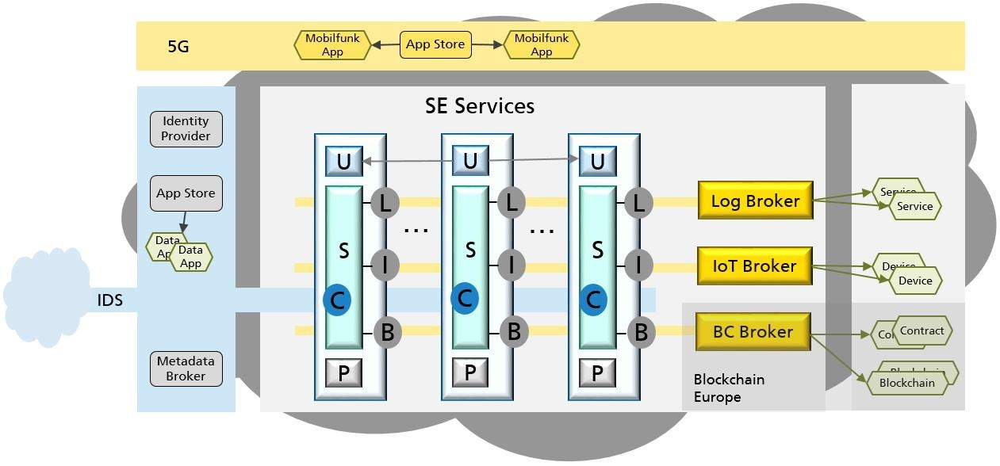

[[chapter-solution-strategy]]
:docinfo: shared
:toc: left
:toclevels: 3
:sectnums:
:copyright: Apache License 2.0

= Solution Strategy

This chapter gives a short summary and explanation of the fundamental decisions and solution strategies, that shape the architecture of the {projectName} project.
They are based on the problem statement, the quality goals and the key constraints from link:01-introduction-and-goals.adoc[chapter 1] and link:02-architecture-constraints.adoc[chapter 2].

== Quality

The quality goals as summarized in link:01-introduction-and-goals.adoc#chapter-1-3[section 1.3] and their matching architecture approaches and means for quality assurance are described in detail in link:10-quality-requirements.adoc[chapter 10].
The key to assure quality is to use quality assurance tools like SonarQube and automated tests in the CI/CD Pipeline.

== Common SE Reference Architecture

All SE components like {projectName} and all SE services follow a common SE reference architecture.

.Silicon Economy reference architecture

This architecture is determined by the following elements:

* A macro-architecture, currently consisting of the IDS infrastructure with its **C**onnectors and the three types of brokers (**L**ogictics, **I**oT, **B**lockchain).
The macro-architecture can be extended by further basic components, e.g. concerning 5G.
* A micro-architecture for the individual SE services and brokers, developed independently of each other, which plug into the macro-architecture and which themselves consist of microservices.
These SE services are link:https://scs-architecture.org/[Self-Contained Systems] (SCS) and gradually enrich the SE architecture in conformity with the SE reference architecture.

Roughly, three layers can be identified in and across all SE services and across the SE architecture:

* The user interface (*U*) is composed of the web UIs and mobile UIs of the individual SE services, which all follow a common style and may refer to each other.
* The business logic (*S*) is realized via multi-tier microservices.
The services are orchestrated using the most appropriate means, from rigid to AI-driven.
* The persistence layer (*P*) is analogously composed of the heterogeneous data stores of the individual SE services, which can also refer to each other.

== Decomposition

The fundamental decisions are to compose SE services and brokers from microservices, in accordance with the reference architecture.
Every microservice is executed in its own application container, and loose coupling by event-based communication is used whenever appropriate.
See link:05-building-block-view.adoc[chapter 5] for details.

== Technology

As detailed in link:02-architecture-constraints.adoc[chapter 2] we use containers running on OKD/Kubernetes, communicating via HTTP/REST, MQTT, AMQP, WebSockets etc.

== Organizational

See link:02-architecture-constraints.adoc[chapter 2] for organizational constraints and political constraints that apply.
We use agile development (Scrum) to fulfill these constraints, organized in separate projects for all SE projects and brokers.
All third-party software used must be open source.

